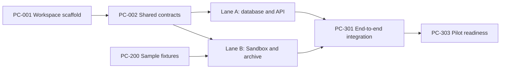

# Parallel Development Plan

## Purpose

Two people will build PocketCloud in parallel with Codex assistance. The goal is to gain real speed without having two models rewrite the same files, invent incompatible types, or merge unfinished assumptions into each other's work.

The operating model is:

```text
One shared architecture
    -> one short foundation merge
    -> two stable work lanes
    -> contract-based integration
    -> small reviewed pull requests
```

## Builder names

Until actual names or GitHub handles are recorded:

- **Builder A:** the person responsible for the control plane.
- **Builder B:** the teammate responsible for the execution plane.

The assignments can be swapped before implementation starts. Avoid swapping individual files story by story because stable path ownership is what prevents collisions.

## The two lanes

### Lane A: Control Plane

Builder A owns the customer-facing and durable orchestration side:

- Monorepo and root workspace configuration
- Web dashboard
- API endpoints
- PostgreSQL schema, migrations, and repositories
- Private upload intent and artifact metadata
- Deployment records and progress API
- Usage limits and rate limiting
- Operator suspension
- Authentication and organizations later

Primary paths:

```text
apps/web/**
apps/api/**
packages/platform/**
packages/core/src/domain/**
packages/core/src/contracts/**
root workspace configuration
database migrations
```

### Lane B: Execution Plane

Builder B owns the untrusted-processing and provider side:

- Sample project fixtures
- Vercel Sandbox adapter
- Archive extraction policy
- Project analyzer
- Deterministic static normalizer
- Structured AI patch flow
- Artifact manifest creation
- Vercel deployment adapter
- Provider status mapping
- Verification and Sandbox cleanup

Primary paths:

```text
apps/worker/**
packages/execution/**
packages/normalizer/**
packages/deployment/**
packages/core/src/archive/**
packages/core/src/analyzer/**
packages/core/src/validators/**
tests/sample-apps/**
```

## Why this split works

The control plane can create and track a deployment without knowing how Vercel Sandbox works. The execution plane can process a deployment without owning customer sessions, UI, or database migrations.

They communicate through a small set of shared contracts:

```text
DeploymentJob
ProjectPlan
ArtifactManifest
NormalizationChange
DeploymentEvent
ProviderDeployment
PocketCloudError
```

Those contracts are defined in [Shared Contracts](11-shared-contracts.md).

## Foundation merge before full parallel work

The repository currently contains documentation only. Before the two lanes begin full feature implementation, Builder A completes and merges the small foundation stories:

1. `PC-001` — TypeScript monorepo scaffold.
2. `PC-002` — Shared domain contracts and deployment state machine.

Builder B can work in parallel on `PC-200` — static and hostile sample fixtures — because that story owns only `tests/sample-apps/**` and does not depend on compiled workspace code.

Once `PC-001` and `PC-002` are merged, both builders create fresh branches from `origin/main` and begin their lanes.

## Dependency picture



## Story claiming protocol

The Markdown backlog defines what exists. GitHub tracks what is happening.

Before starting a story:

1. Confirm every dependency is merged into `main`.
2. Search open issues and PRs for the story ID.
3. Assign the GitHub Issue to yourself.
4. Add the appropriate workstream label.
5. Create a fresh branch from `origin/main`.
6. Tell Codex the exact story ID and lane.

Recommended labels:

```text
workstream:control-plane
workstream:execution-plane
workstream:integration
type:foundation
type:feature
type:test
status:blocked
interface-change
security-impact
```

Do not update the Markdown backlog for normal status changes. Both builders editing the same table repeatedly would create the conflict the process is trying to avoid.

## Branch and PR conventions

Branch:

```text
agent/pc-101-neon-schema
agent/pc-202-safe-archive
```

Commit:

```text
PC-101 Add initial platform schema
```

Pull request:

```text
[PC-101] Add initial platform schema
```

Every PR should reference one primary story. A PR may include a tiny prerequisite only when that prerequisite does not belong to another active story and is explained clearly.

## Shared-file protocol

Shared files are the highest conflict risk:

- Root workspace configuration
- Lockfile
- Domain contracts
- Public package exports
- Database migrations
- Integration test orchestration
- Architecture and collaboration documentation

Rules:

1. Builder A is the default owner of root configuration and domain contracts.
2. Builder B asks for or proposes an interface change before editing those files.
3. Shared changes are merged before dependent lane changes.
4. The other builder reviews every shared-contract PR.
5. Do not combine a broad shared refactor with a feature story.

## Package dependency direction

Use this dependency direction:

```text
apps/web ---------> shared contracts
apps/api ---------> core + platform
apps/worker ------> core + execution + normalizer + deployment + platform

normalizer -------> core
execution --------> core
deployment -------> core
platform ---------> core

core -------------> no PocketCloud package
```

Prohibited examples:

- `core` importing Vercel or Neon SDKs
- `api` importing worker implementation files
- `worker` importing web or API route files
- `normalizer` writing directly to PostgreSQL
- `deployment` depending on the AI normalizer

## Merge order

Merge in dependency order, not in completion-time order.

Example:

```text
PC-001 scaffold
    -> PC-002 contracts
    -> PC-101 database and PC-201 Sandbox can proceed in parallel
    -> PC-102 upload and PC-202 archive can proceed in parallel
    -> lane-specific stories continue
    -> PC-301 integration
```

If a later PR finishes before its dependency, leave it open and update it after the dependency merges. Do not merge placeholder duplication merely to unblock the branch.

## Daily coordination routine

Ten minutes is enough:

1. State the story each builder owns.
2. Name shared files each expects to touch.
3. Name any contract change being proposed.
4. Agree on expected merge order.
5. Review the other builder's latest handoff note.

Useful status format:

```text
Builder A: PC-102, apps/api + packages/platform/storage, no interface change.
Builder B: PC-202, packages/core/src/archive, proposes new ARCHIVE_UNSAFE_PATH error.
Merge order: PC-202 contract addition first, then PC-102 integration.
```

## Codex session startup

Start every model session with:

```text
Read AGENTS.md and the required architecture documents first.
I am Builder <A|B>, working only on story <PC-ID>.
Check its dependencies and existing open work before editing.
Stay inside the story's owned paths. If a shared contract must change, stop and explain the proposed interface change before editing it.
Implement, test, and provide the handoff described in docs/12-agent-handoffs.md.
```

## Conflict recovery

If both branches changed the same non-generated file:

1. Stop automatic conflict resolution.
2. Identify which story owns the file.
3. Preserve the owning story's implementation.
4. Reapply the non-owner's required behavior through the documented contract.
5. Have both builders review the resolution.

Do not ask an AI model to choose between two conflicting business semantics without owner input.

## Definition of parallel-safe

A pair of stories is parallel-safe when:

- Dependencies are merged.
- Their primary paths do not overlap.
- They consume the same merged contract version.
- Neither requires the other's unmerged behavior.
- Their external side effects use separate test resources or stable idempotency keys.

The backlog marks stories that are intended to run concurrently.
